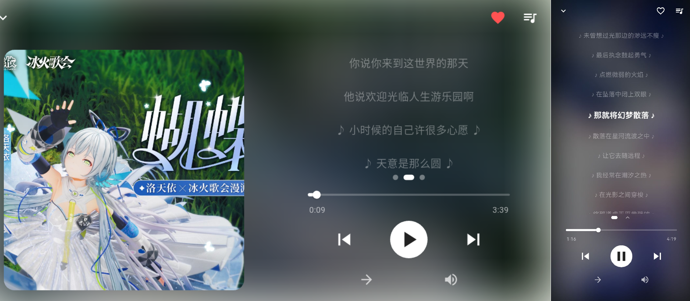
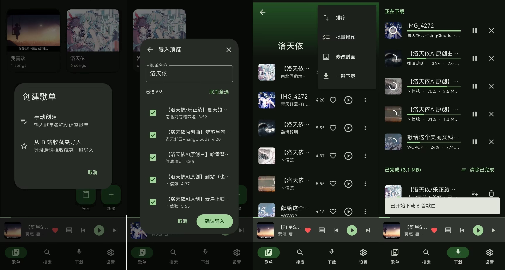
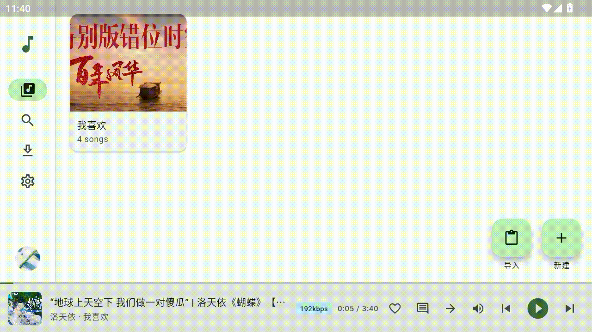

# BuSic 🎵

<!-- 这里可以放一个精美的项目 Logo 或是 Banner： -->
<!--  -->

**一个高颜值、跨平台、基于 Flutter 的音乐播放器 🎧**

---

BuSic 致力于为你提供一个纯粹、流畅的音乐聆听体验。它不仅支持多平台原生运行，还能让你摆脱繁杂的视频界面，专注享受高品质音频流。

## ✨ 核心特性

- 🌍 **全平台支持**：横跨 Linux、Windows、macOS、Android 和 iOS，一致的丝滑体验。
- 🎵 **在线高清播放**：直接解析并播放音乐，支持登录账号以解锁更高音质（如 Hi-Res、无损等）。
- 💾 **本地离线下载**：支持将喜欢的音乐下载至本地，随时随地免流收听。
- 🔍 **便捷检索**：支持关键词快捷搜索，精准直达目标曲目。
- 🎤 **智能歌词**：实时显示歌词，支持滚动同步和多语言切换。
- 🎨 **现代化 UI**：简洁美观的设计语言，支持响应式布局，适配桌面与移动端。
- ⚡ **高性能**：基于 `media_kit` 核心构建，极速响应，低资源占用。

## 📸 应用预览

全屏播放页：

从 BiliBili 收藏夹导入：

搜索播放：

---

## 🚀 安装与运行

你可以前往 [Releases](https://github.com/GlowLED/BuSic/releases) 页面下载适用于你平台的最新编译版本，开箱即用。

> 若需本地编译或参与开发，请参考我们的 [构建指南](docs/build-guide.md) 和 [开发工作流](docs/dev-workflow.md)。

---

## ⚖️ 免责声明与合规性 (必读)

本项目旨在为开发者提供一个 **Flutter 跨平台开发及音视频技术的学习研究案例**。为了尊重版权及避免法律风险，使用本项目即表示您同意以下条款：

1. **技术中立**：BuSic 本质上是一个本地资源解析与渲染工具（类似一个特制的网页浏览器）。本软件**不提供**任何音视频的上传、存储、分发服务，也**不包含**任何破解数字版权保护（DRM）的代码。
2. **版权归属**：软件所访问的所有媒体内容、弹幕、评论及元数据信息，其版权均归属 **原作者** 所有。
3. **合理使用（非商业用途）**：本项目采用无营利性质的开源模式，**严禁任何人将本项目及其衍生品用于任何商业或盈利目的**。请在下载体验后的 24 小时内删除本项目及相关数据。
4. **账号风险自担**：用户需对自己的请求行为负责。因使用本第三方开源软件导致的任何账号风控、限制或封禁等异常情况，开发者概不负责。
5. **无关联声明**：本项目由第三方开源社区爱好者独立开发，与 Bilibili 官方**没有任何从属、赞助、授权或关联关系**。

若您认为本项目侵犯了您的权益，请通过 Issue 联系我们，我们将积极处理。

## 🤝 参与贡献

我们非常欢迎开发者一起完善 BuSic！
* 有任何问题或建议，欢迎提交 [Issue](https://github.com/GlowLED/BuSic/issues)。
* 想要贡献代码？请先阅读 [开发文档](docs/pro-struc.md) 与 [代码贡献指南](CONTRIBUTING.md)，然后提交 Pull Request。

## 📄 许可证

本项目基于 [GPL-3.0 License](LICENSE) 协议开源。
